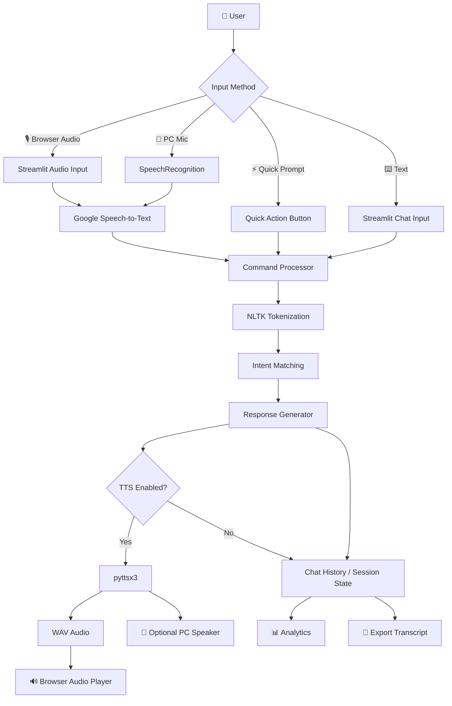
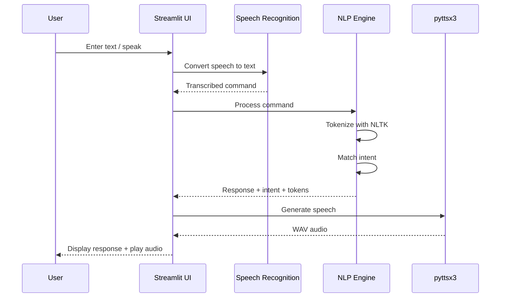
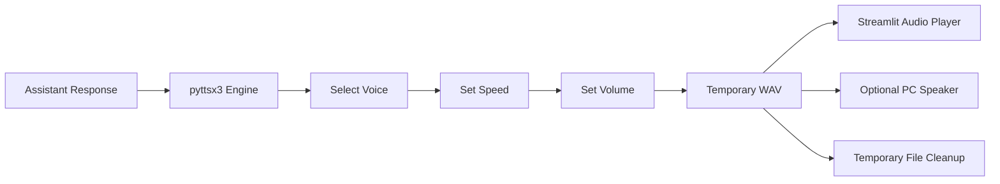
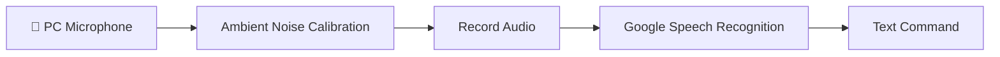
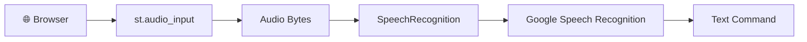
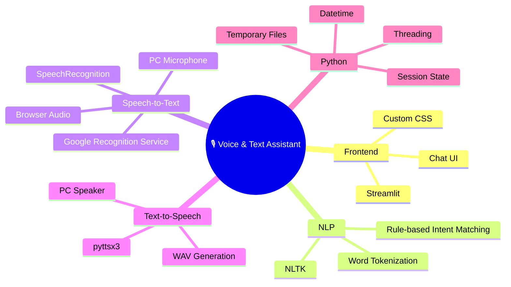

# 🎙️ Python Voice & Text Assistant

> **An interactive Streamlit-based voice and text assistant combining NLP intent matching, Google Speech Recognition, and offline desktop Text-to-Speech.**

---

## ✨ Overview

**Python Voice & Text Assistant** is an interactive desktop/web interface built with **Streamlit**. It accepts commands through:

- 🎤 PC microphone
- 🎙️ Browser audio recorder
- ⌨️ Text chat
- ⚡ Quick command buttons

The application processes user input with **NLTK tokenization**, matches the tokens against predefined intents, generates a response, and can convert that response into speech using **pyttsx3**.

The current implementation supports common assistant commands such as greetings, time/date queries, Python and AI information, help, repeat, thanks, and exit commands. fileciteturn0file0L197-L335

---

## 🖥️ What the App Looks Like

The UI uses a dark glassmorphism-inspired design with:

- 🌌 Dark gradient background
- 🎙️ Assistant status indicator
- 💬 Chat interface
- 🔊 TTS controls
- 🎤 Speech recognition controls
- 📊 Live session analytics
- 🔍 NLP/token inspection
- 💾 Conversation export
- ⚡ Quick-action prompts

The Streamlit page is configured as a wide application titled **"AI Voice & Text Assistant"**. 

> 📸 **Add your application screenshot here**
>
> Save a screenshot as `assets/app-preview.png` and uncomment:
>
> ```markdown
> 
> ```

---

## 🚀 Features

| Feature | Description |
|---|---|
| 🎤 **PC Microphone STT** | Records from the local microphone and converts speech to text |
| 🎙️ **Browser Recorder** | Records audio through Streamlit's browser audio input |
| ⌨️ **Text Chat** | Send commands directly through the chat input |
| 🧠 **NLP Tokenization** | Uses NLTK `word_tokenize()` to split commands into tokens |
| 🎯 **Intent Detection** | Matches token patterns to predefined assistant intents |
| 🔊 **Text-to-Speech** | Generates WAV speech using `pyttsx3` |
| 📢 **Desktop Speaker** | Optional direct playback through the computer's speakers |
| ▶️ **Autoplay** | Automatically plays the latest generated response when enabled |
| 🗣️ **Multiple Languages** | Supports `en-US`, `en-IN`, and `en-GB` recognition settings |
| 📊 **Session Analytics** | Tracks messages, voice turns, and parsed tokens |
| 🔍 **NLP Inspector** | Displays matched intent and extracted tokens |
| 💾 **Chat Export** | Downloads the current conversation as a `.txt` file |
| 🗑️ **Clear Chat** | Resets the current conversation |
| ⚡ **Quick Prompts** | One-click commands for common interactions |

The sidebar exposes TTS settings, speech-recognition language/calibration controls, session statistics, chat reset, transcript export, and an available-command cheat sheet. fileciteturn0file0L458-L590

---

## 🧩 Architecture



---

## 🔄 How It Works



---

## 🧠 NLP Intent Engine

The assistant currently uses a **rule-based intent engine** rather than a machine-learning model.

The input is first tokenized using NLTK. The application then checks for keywords and token combinations to identify an intent. fileciteturn0file0L197-L219

### Supported Intents

```text
👋 Greeting
   └── hello / hi / hey

😊 Status Check
   └── how + you

🤖 Identity
   └── name

⏰ Current Time
   └── time

🐍 Knowledge: Python
   └── python

🧠 Knowledge: AI
   └── ai / artificial / intelligence

🙏 Gratitude
   └── thank / thanks

🆘 Assistance
   └── help

🔁 Echo / Repeat
   └── repeat

📅 Current Date
   └── date / today

👋 Farewell
   └── goodbye / bye / exit / quit

❓ Unknown Command
   └── fallback
```

The corresponding intent rules and responses are implemented in `process_command()`. fileciteturn0file0L221-L335

---

## 🔊 Text-to-Speech Pipeline

The project uses **pyttsx3** to generate speech and save it as a temporary WAV file.



The app allows voice selection, speaking speed, volume, browser autoplay, and optional direct PC-speaker playback. fileciteturn0file0L335-L387

---

## 🎤 Speech-to-Text Pipeline

The application provides two speech-input paths.

### 1. PC Microphone

The local microphone is accessed through `SpeechRecognition`, background noise is calibrated, audio is recorded, and Google's recognition service transcribes the audio. fileciteturn0file0L389-L412



### 2. Browser Audio

Streamlit's `st.audio_input()` records audio in the browser. The recorded bytes are passed through `SpeechRecognition` and transcribed. fileciteturn0file0L413-L432



---

## 🖱️ Quick Commands

The application provides one-click prompts for common tasks:

| Button | Example Command |
|---|---|
| 👋 Hello | `Hello boss!` |
| ⏰ Time | `What is the current time?` |
| 📅 Date | `What is today's date?` |
| 🧠 AI | `What is Artificial Intelligence?` |
| 🐍 Python | `Tell me about Python` |
| 😊 Status | `How are you?` |
| 🆘 Help | `Can you help me?` |

These quick actions are defined directly in the Streamlit interface. fileciteturn0file0L617-L636

---

## 📊 Session Analytics

The sidebar provides three live metrics:

```text
┌──────────────────────────────────────────┐
│              SESSION ANALYTICS            │
├────────────────┬────────────┬────────────┤
│ Total Messages│ Voice Turns│ Tokens      │
│      💬        │     🎙️     │     🧠      │
└────────────────┴────────────┴────────────┘
```

The counters are maintained with Streamlit `session_state`. fileciteturn0file0L433-L456

---

## 🗂️ Suggested Project Structure

```text
python-voice-text-assistant/
│
├── 📄 app.py
├── 📄 requirements.txt
├── 📄 README.md
├── 📄 .gitignore
│
├── 📁 assets/
│   └── 🖼️ app-preview.png
│
└── 📁 .venv/
    └── 🚫 Not committed to Git
```

> Rename your uploaded Python file to `app.py` if you want to follow this structure.

---

## ⚙️ Installation

### 1. Clone the repository

```bash
git clone https://github.com/YOUR_USERNAME/YOUR_REPOSITORY.git
cd YOUR_REPOSITORY
```

### 2. Create a virtual environment

#### Windows

```bash
python -m venv .venv
.venv\Scripts\activate
```

#### macOS / Linux

```bash
python3 -m venv .venv
source .venv/bin/activate
```

### 3. Install dependencies

```bash
pip install -r requirements.txt
```

### 4. Download / initialize NLTK resources

The application attempts to initialize the required NLTK tokenizer resources automatically at startup. fileciteturn0file0L182-L195

If needed, you can also run:

```python
import nltk

nltk.download("punkt")
nltk.download("punkt_tab")
```

---

## ▶️ Run the Application

Start Streamlit with:

```bash
streamlit run app.py
```

Then open the local URL shown by Streamlit, usually:

```text
http://localhost:8501
```

---

## 🎛️ Configuration

### 🔊 TTS

Available controls include:

- Enable/disable voice output
- Enable/disable autoplay
- Voice persona
- Speech speed
- Volume
- Optional PC-speaker output

The TTS settings are exposed through the sidebar. fileciteturn0file0L475-L497

### 🎤 STT

Available controls include:

- Spoken language:
  - `en-US`
  - `en-IN`
  - `en-GB`
- Ambient-noise calibration duration

fileciteturn0file0L502-L514

---

## 🧪 Example Interaction

```text
You:
    What is AI?

Assistant:
    Artificial intelligence allows computers to perform
    tasks that normally require human intelligence.

Intent:
    Knowledge: AI

Tokens:
    what | is | ai | ?
```

For another example:

```text
You:
    What time is it?

Assistant:
    The current time is 05:30 PM

Intent:
    Current Time
```

---

## 🧱 Technology Stack



---

## 🔐 Important Notes

### Internet requirement

The current speech-recognition implementation uses Google's speech-recognition service, so **speech-to-text requires an internet connection**.

### Microphone requirement

PC microphone mode requires a working microphone and the audio dependency used by `SpeechRecognition`.

### pyttsx3

`pyttsx3` uses the speech engines available on the local operating system. On Windows, available voices can depend on installed Microsoft speech voices.

### No generative AI yet

Despite being called an assistant, the current response engine is **rule-based**. It does not currently call an LLM, vector database, RAG system, or external generative-AI API. The core command processing is implemented through token matching and predefined responses. fileciteturn0file0L197-L335

---

## 🛠️ Current Limitations

- Intent detection is keyword/rule based.
- The knowledge base is limited to predefined commands.
- Google Speech Recognition requires internet connectivity.
- PC microphone recording currently uses a phrase time limit rather than a fully automatic silence-based conversation loop.
- The assistant does not yet maintain semantic long-term memory.
- The current implementation is primarily an educational/project demonstration.

The PC microphone function currently uses `phrase_time_limit`, while browser recording is handled separately through `st.audio_input()`. fileciteturn0file0L392-L405

---

## 🚀 Future Improvements

Potential next versions could add:

```text
                    ┌─────────────────────┐
                    │ Current Assistant   │
                    └──────────┬──────────┘
                               │
              ┌────────────────┼────────────────┐
              ▼                ▼                ▼
        🤖 LLM Integration   🧠 Memory      🗣️ Better STT
              │                │                │
              ▼                ▼                ▼
         Generative AI       Vector DB      Silence Detection
              │                │                │
              └────────────────┼────────────────┘
                               ▼
                    🚀 Advanced AI Assistant
```

Possible upgrades:

- 🤖 Gemini / OpenAI / local LLM integration
- 🧠 Conversation memory
- 📚 RAG with PDFs/documents
- 🔎 Semantic search
- 🎙️ Automatic silence detection
- 🔄 Continuous voice conversation loop
- 🗣️ Wake-word detection
- 🌐 More languages
- 👤 User profiles
- 📝 Persistent chat history
- 📈 Advanced analytics
- 🧪 Automated testing
- 🐳 Docker deployment
- ☁️ Cloud deployment

---

## 📁 Main Application Components

| Component | Responsibility |
|---|---|
| `init_nltk()` | Initializes tokenizer resources |
| `process_command()` | Tokenizes input and identifies intent |
| `generate_tts_bytes()` | Generates WAV speech |
| `speak_desktop_async()` | Plays TTS through PC speakers |
| `record_from_microphone()` | Captures and transcribes PC microphone input |
| `transcribe_uploaded_audio()` | Transcribes browser-recorded audio |
| `handle_chat_submission()` | Connects input → NLP → TTS → chat history |
| `st.session_state` | Maintains conversation/session data |

The main chat handler appends the user message, processes the command, updates token statistics, generates TTS when enabled, and stores the assistant response. fileciteturn0file0L680-L734

---

## 💾 Exporting Conversations

Use the **💾 Export** button in the sidebar to download the current conversation as a `.txt` transcript.

The exported filename follows this pattern:

```text
voice_chat_YYYYMMDD_HHMMSS.txt
```

fileciteturn0file0L543-L570

---

## 🤝 Contributing

Contributions are welcome.

```bash
# Fork the project
# Create a feature branch
git checkout -b feature/new-feature

# Make your changes
git add .
git commit -m "Add new feature"

# Push your branch
git push origin feature/new-feature
```

Then open a Pull Request on GitHub.

---

## 📜 License

You can add your preferred license here, for example:

```text
MIT License
```

If this is a college project, choose the license according to your submission/repository requirements.

---

## 👨‍💻 Author

**Yash**

Built as a Python/NLP/Speech project demonstrating:

`Python` • `Streamlit` • `NLP` • `Speech-to-Text` • `Text-to-Speech`

---

## ⭐ If You Like This Project

If this project helped you learn Python, NLP, STT, TTS, or Streamlit:

- ⭐ Star the repository
- 🍴 Fork it
- 🛠️ Experiment with the intent engine
- 🚀 Add an LLM and turn it into a more advanced AI assistant

---

<p align="center">
  <b>🎙️ Speak. Understand. Respond. 🔊</b>
</p>
